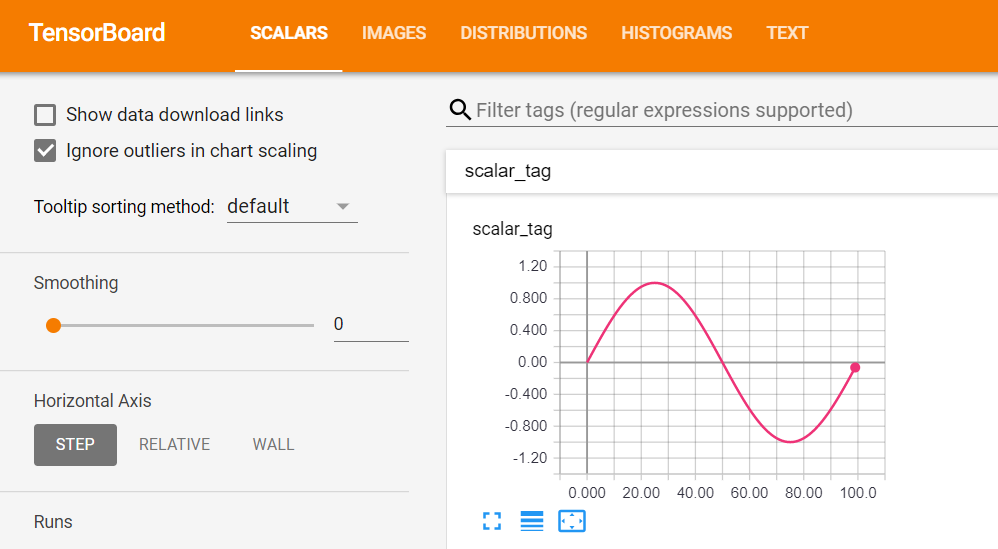
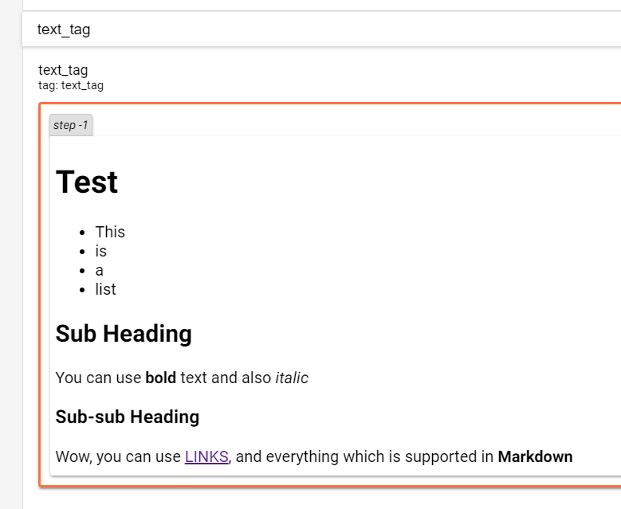

# Swiss Army Tensorboard

A tool which helps to release the true potential of [Tensorboard](https://www.tensorflow.org/guide/summaries_and_tensorboard).



## Loggers

- Text logger
- Continuous text logger
- Scalar logger
- Histogram logger
- Image logger

## Setup

`pip install git+https://github.com/gaborvecsei/Swiss-Army-Tensorboard.git`

## Example

There is an example for every logger inside [`logger_examples.py`](example/logger_examples.py).

Just a quick snippet how easy to use this package:

```python
import numpy as np
from swiss_army_tensorboard import tfboard_loggers


scalar_logger = tfboard_loggers.TFBoardScalarLogger("./log_folder")

for i, t in enumerate(np.arange(0.0, 1.0, 0.01)):
    val = np.sin(2 * np.pi * t)
    scalar_logger.log_scalar("scalar_tag", val, i)
```

Text logger output (inside Tensorboard):



## Reference

Part of the functions are made based on the following gist:

*[1]* https://gist.github.com/gyglim/1f8dfb1b5c82627ae3efcfbbadb9f514

## About

Gábor Vecsei

- [Website](https://gaborvecsei.com)
- [Personal Blog](https://gaborvecsei.wordpress.com/)
- [LinkedIn](https://www.linkedin.com/in/gaborvecsei)
- [Twitter](https://twitter.com/GAwesomeBE)
- [Github](https://github.com/gaborvecsei)
